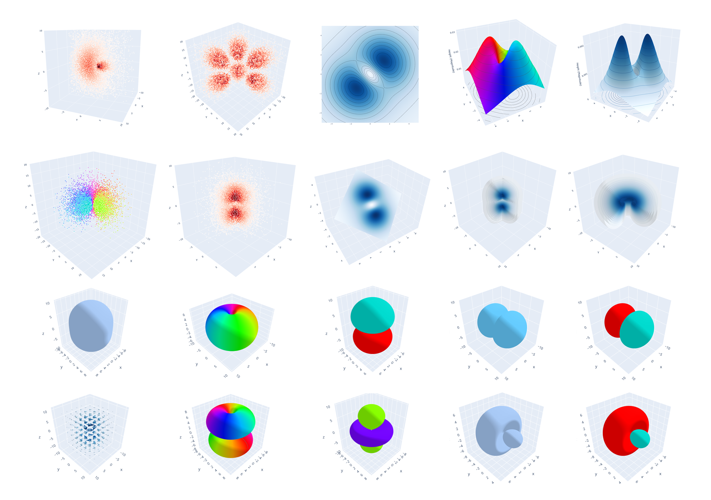

# Hydrogenic Orbitals Visualized

Dirac orbital 1s2p3s4f density, current, and four components ($\psi_1$, $\psi_2$ (top) $\psi_3$, $\psi_4$ (bottom)), with k ranging from -4 (bottom) to 3 (top) and m from -7/2 (left) to 7/2 (right) (excluding m=0).  
Isosurface level at 0.1×max value. All plots are scaled, isosurface sizes are not directly comparable.  
Generated using `fig_grid.py`

1s~6h version k: -6~5 m: -11/2~11/2

## Dependencies

- plotly
- numpy
- scipy (>=1.15.0)
- scikit-image

## Usage

see examples
